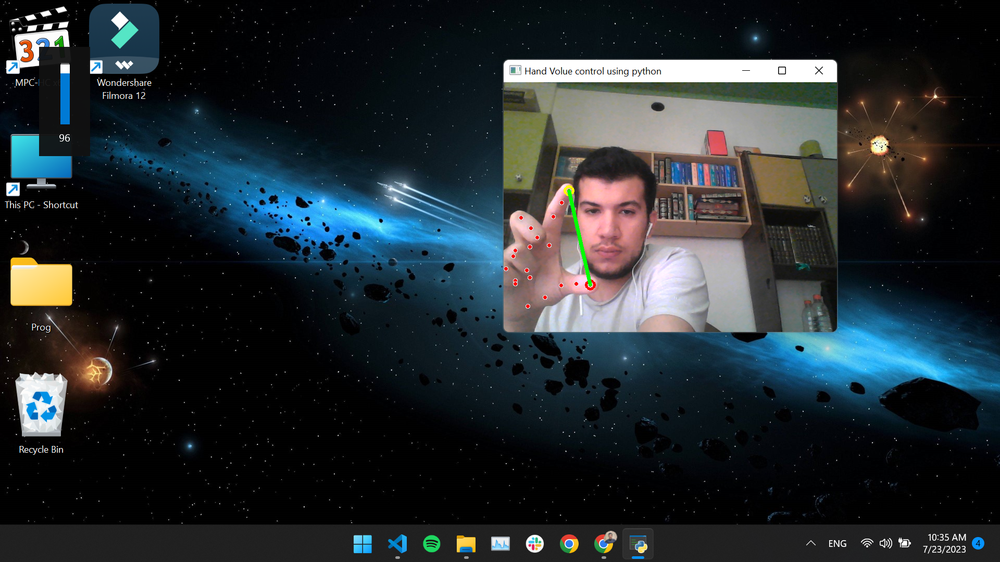
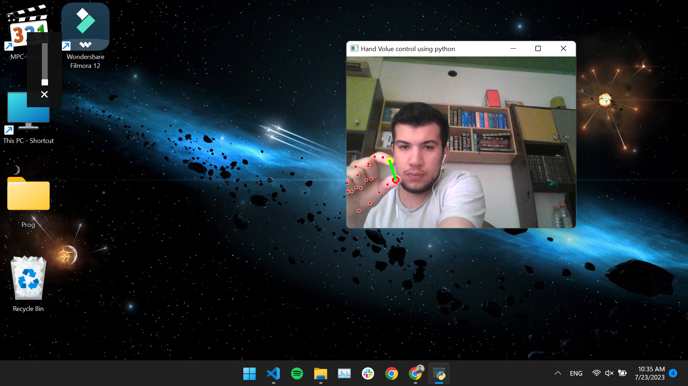

# Hand Volume Control using Python and OpenCV




## Introduction

Hand Volume Control is a Python program that uses the OpenCV library and a webcam to detect hand movements and control the volume of a PC. By moving your fingers apart or together, you can increase or decrease the volume respectively. The program utilizes the MediaPipe library for hand tracking and PyAutoGUI to simulate keyboard presses for volume control.

## Requirements

Before running the program, ensure you have the following installed:

1. Python (3.x recommended)
2. OpenCV (cv2)
3. Mediapipe
4. PyAutoGUI

You can install the required Python packages using pip:


## How to Run

1. Clone this repository to your local machine or download the `hand_volume_control.py` file.
2. Make sure you have a webcam connected to your computer.
3. Open a terminal or command prompt and navigate to the folder containing the `hand_volume_control.py` file.
4. Run the Python script:
```bash
python hand_volume_control.py
```
  
5. The webcam window will open, showing the video feed with hand landmarks drawn on it.

## How It Works

The program captures the video feed from your webcam and uses the MediaPipe library to detect and track your hand movements. It identifies two specific landmarks on your hand to determine the distance between your fingers: landmark ID 8 (index fingertip) and landmark ID 4 (thumb tip).

By calculating the distance between these two landmarks, the program estimates whether you are moving your fingers apart or together. If the distance exceeds a predefined threshold, it simulates the "volume up" key press using PyAutoGUI. Otherwise, it simulates the "volume down" key press.

## Gesture Recognition

To control the volume:

- Place your hand in front of the webcam with your palm facing the camera.
- Move your index finger and thumb apart to increase the volume.
- Move your index finger and thumb together to decrease the volume.

## Exiting the Program

To exit the program, press the "Esc" key while the webcam window is active.

## Troubleshooting

1. Ensure that you have installed all the required Python packages mentioned in the "Requirements" section.
2. Make sure your webcam is functioning correctly and is properly connected to your computer.
3. If the hand tracking is not accurate, try adjusting the lighting conditions or the position of your hand.

## Limitations

- The accuracy of hand tracking and gesture recognition may vary based on lighting conditions and camera quality.
- The program may not work well in cluttered or busy backgrounds.
- Currently, the program supports only the "volume up" and "volume down" actions.

## Contributions

Contributions to this project are welcome. If you have any suggestions, improvements, or bug fixes, feel free to submit a pull request.

## License

This project is licensed under the [MIT License](https://opensource.org/licenses/MIT). You are free to use, modify, and distribute the code.

## Acknowledgments

- This project was inspired by the potential for using hand gestures for controlling computer systems.
- The program utilizes the OpenCV library and the MediaPipe hand tracking solution.
- Special thanks to the developers and contributors of OpenCV, MediaPipe, and PyAutoGUI for their invaluable work in the open-source community.

---
